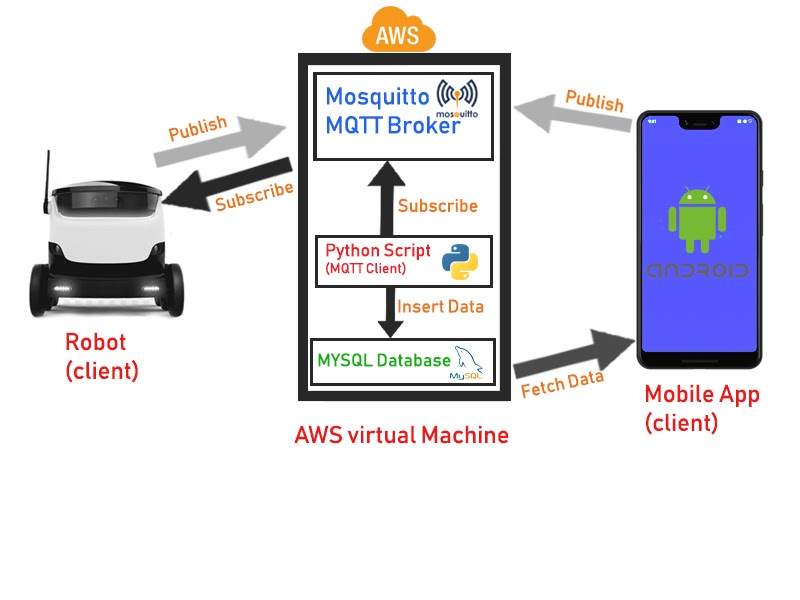

<!DOCTYPE html>
<html>
<head>
	<h2>Autonomous Agricultural Robot</h2>
</head>
<body>
	<h4>Group Members</h4>
		

			
Denuke Dissanayake - E/16/089 - e16089@eng.pdn.ac.lk

			
Maneesha Randeniya - E/16/313 - e16313@eng.pdn.ac.lk

			
Nipun Dewanarayana - E/16/360 - e16360@eng.pdn.ac.lk

		

    <h4>Description</h4>
		

			
AgriBot is an automated robot. A mobile app is used to collect the information and displayed a graphical change oftemperature and humidity to the user. Mobile app is used to give start, stop, pause commands to the robot and details about the field, like row length, gap of seeds, gap of rows, how many rows like that.
using those informations robot will go to each point and drill the soil, plant a seed.
      
 
			
The main purpose of our Robot is plant seeds over large farm areas!!!!
 
      
As we said earlier Our mobile app give the basic control signals and parameters of the field to the AWS server and the robot will fetch it and create a map of the field using some algorithms, then using the encoders of the gear motors and gyroscope we can move the robot throughout the map and plant the seeds, After we send the basic params from our mobile app whole process works as a autonomous manner. User have to give the number of rows he want to seed, gap between two seeds and two rows and length of a each row. Using this method, we can cover the whole area.
      

		

	 
	<h4>Why we need an AgriBot</h4>
	 
	

	

		Smart Farming is a widely growing area. First we talk about the smart farming. In smart farming user can monitor their field via smart
device and control the watering, fertilizing autonoumously. With this concept people tried to develope into next level. They want to use 
robots into the field to reduce the labour work. There are robots which can do seeding, cropping, investigate deseases and literally everything.
So now people are not just monitoring the field, they can maintain the whole field and labour cost is minimum. So you will ask if already 
there are machines which can seeding, why we need an agribot? The answer is normally there are some machines which consume lot of power
because they have heavy machinary components. They have lot of disadvantages like, they have huge drilling components which turn upside down the 
field area, not good for the soil creatures and soil structure, sound and air polution, not good for small seeds. In that case agribot 
works really well, it can map the whole field and seeding. Agribot is only drill point where we need to put seed. Also cost effective,
light weight and echo friendly. This is the best way to seeding small seeds in big areas. Another thing is very easy to operate through 
a user friendly mobile app.
	

	

		<h5>AgriBot for Greenhouse farming</h5> 
	

	

		AgriBot is the best solution for modern Greenhouses because those are full covered areas which have sensitive sensors all over the place.
Because in greenhouses every condition which plant will be depend, is measured and controlled accurately and another thing is there are tap
lines all over the place. For areas like this you cant use heavy machinaries or drones to seed plants and AgriBot is the perfect solution.
	
 
	

	
    
	
   <h4>Advisers</h4>
    
 Dr Isuru Nawinna 

    
 Dr Ziyan Marrikkar 

		<h4>Links :</h4>
			

				
<a href="https://www.pdn.ac.lk/academics/academics.php/ "> University of Peradeniya</a> 

				
<a href="http://eng.pdn.ac.lk/"> Faculty of Engineering</a>

        
<a href="http://www.ce.pdn.ac.lk/"> Department of Computer Engineering </a> 

			

	
	
</body>
</html>
